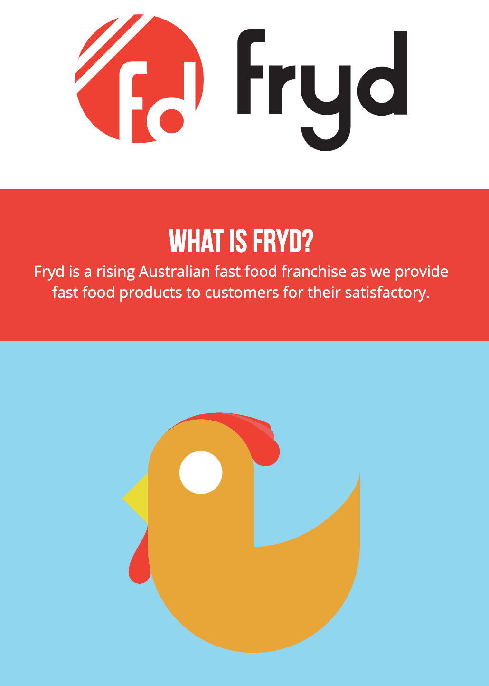

# Fryd Infographic Webpage

[Visit actual page](https://johnnyhuy.github.io/fryd/index.html)

This was created during my studies in 2015 at Copperfield College in my Visual Communication class. It was a final project for the year to present to the art teachers.

## Objective

The goal was to create a brand and present it in a way to capture the audiences interest. There were different ways to approach this objective, though I decided to create physical and online infographic.
